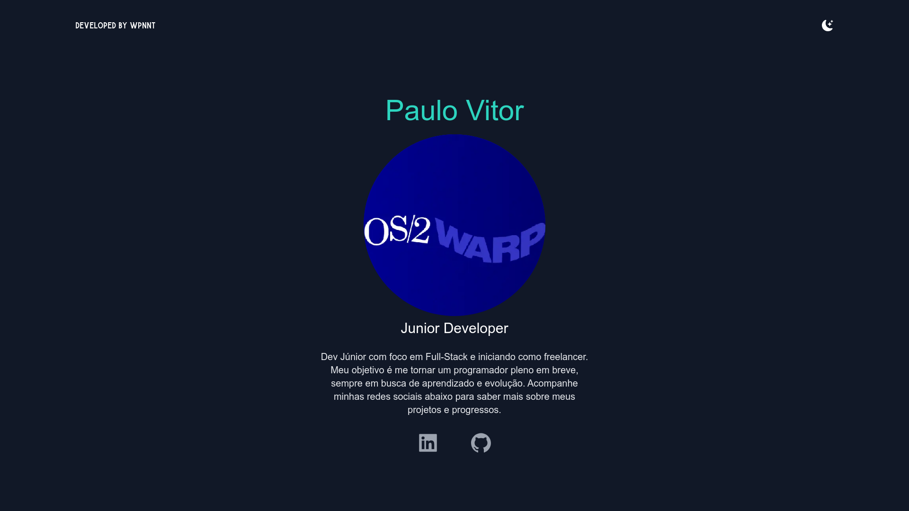

---
# 🌐 Portfolio Web React 

Bem-vindo ao repositório do meu **Portfólio Pessoal**! 🚀 Desenvolvido com **React.js**, este projeto funciona como um espaço para apresentar minhas habilidades, projetos e conquistas. Seja você um recrutador, colaborador ou apenas alguém buscando inspiração para criar seu próprio portfólio, você está no lugar certo!

  

---

## 📖 Sobre o Projeto  

Este portfólio foi projetado para:  
1. **Destacar minhas habilidades e experiência** em desenvolvimento **web** e outras áreas relevantes.  
2. Fornecer uma **interface interativa e visualmente atrativa** para exibir meus projetos.  
3. Servir como um hub central onde recrutadores, colaboradores e colegas podem saber mais sobre mim.

##  💻Tecnologia

- React
- javascript
- CSS
- TailwindCSS
- TMDB API 

Utilizando **React.js**, criei uma interface rápida, responsiva e amigável ao usuário, com princípios de design modernos. O projeto conta com componentes reutilizáveis, estilização modular e conteúdo dinâmico, garantindo que ele seja sempre atualizado e escalável. 

 <h2>👨‍💻Author</h2>
<table>
  <tr>
    <td align="center">
      <a href="https://github.com/Wpnnt">
         
        
          <b>Warph</b>
        
      </a>
    </td>
  </tr>
</table>

---
